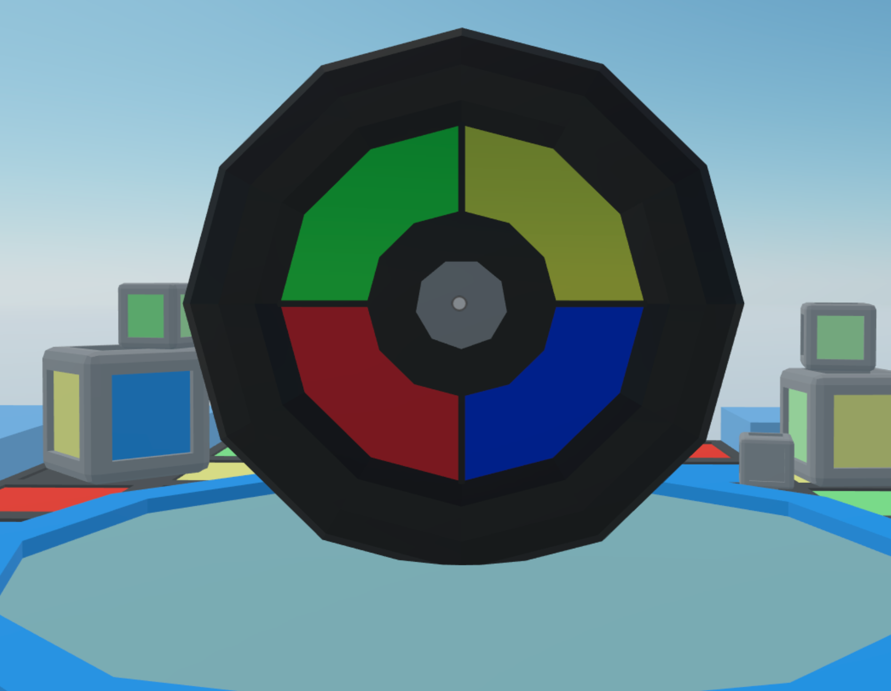

## Memory game

A Simon Says game, with click interactions and sequenced actions. The game generates a random sequence of colors and you must click buttons to match those.




This scene shows you:

- How to change materials on a primitive shape
- How to handle click events
- How to use custom components to store custom data
- How to use component groups to handle various entities
- How to use a system to handle a game's rules and logic


## Try it out

**Install the CLI**

Download and install the Decentraland CLI by running the following command:

```bash
npm i -g decentraland
```

**Previewing the scene**

Download this example and navigate to its directory, then run:

```
$:  dcl start
```

Any dependencies are installed and then the CLI opens the scene in a new browser tab.

**Scene Usage**


Click the button in the center to start a game. Repeat the sequence of colors by clicking the colored panels. If you make a mistake, you must start again.


Learn more about how to build your own scenes in our [documentation](https://docs.decentraland.org/) site.

If something doesn’t work, please [file an issue](https://github.com/decentraland-scenes/Awesome-Repository/issues/new).

## Copyright info

This scene is protected with a standard Apache 2 licence. See the terms and conditions in the [LICENSE](/LICENSE) file.
